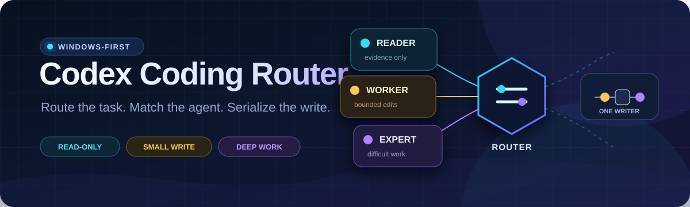
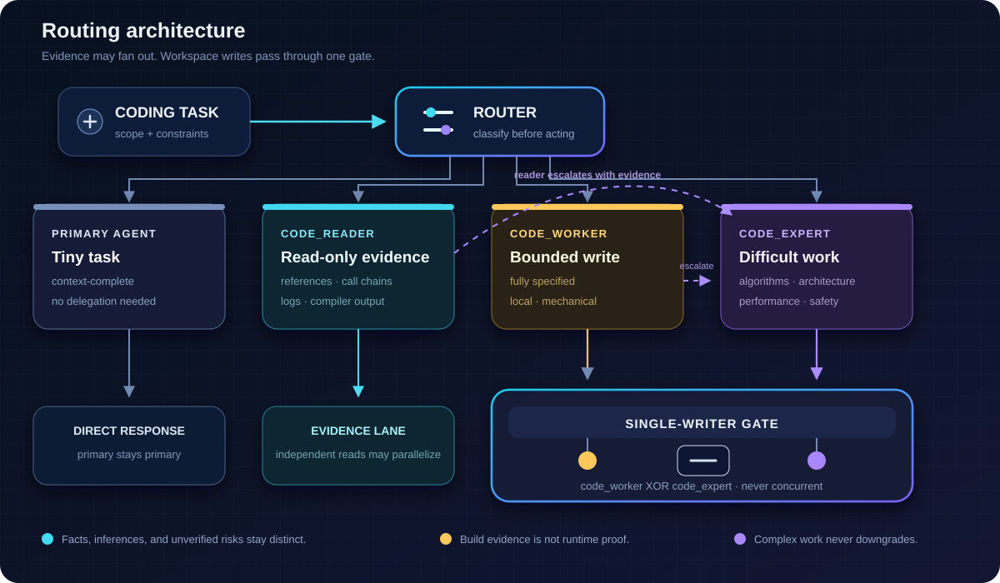

<p align="center">
  
</p>

<p align="center">
  <strong>仅支持 Windows · PowerShell 5.1+ · MIT 许可证</strong><br>
  <a href="README.md">English</a>
</p>

# Codex Coding Router

Codex Coding Router 是一个可移植的 Skill 与三代理路由包，用于把仓库任务交给
足够胜任且最轻量的代理。它把只读探索与工作区写入分开，在任务变难时进行升级，
并保证任何时刻最多只有一个代理写入工作区。



## 路由模型

| 任务形态 | 路由 | 模型 | 推理强度 | 沙箱 |
|---|---|---|---|---|
| 很小且上下文完整的任务 | 主代理 | 当前主模型 | 当前设置 | 当前设置 |
| 大范围只读搜索、引用、调用链、日志、构建证据 | `code_reader` | `gpt-5.6-luna` | `medium` | `read-only` |
| 需求完整的局部机械修改或普通小缺陷 | `code_worker` | `gpt-5.6-luna` | `medium` | `workspace-write` |
| 算法、架构、跨模块、性能、内存安全、并发、数值方法、几何、体素或困难调试 | `code_expert` | `gpt-5.6-sol` | `high` | `workspace-write` |

路由器会尊重用户明确指定的代理与只读限制，并且不会更改主模型。

### 升级与写入串行化

- `code_reader` 只收集证据。若证据表明需要复杂推理或修改，保留证据并升级到
  `code_expert`。
- `code_worker` 只处理边界清楚的机械工作。若范围变难或不明确，停止 worker，
  把证据与准确的工作区改动交给 `code_expert`。
- 复杂实现不会再从 `code_expert` 降级回 `code_worker`。
- 只有互相独立的只读任务可以并行。
- 启动写代理前，必须等待相关 reader 完成。
- 不得并发运行 `code_worker` 与 `code_expert`；任何时刻最多一个工作区写代理。
- 除非用户明确要求，否则代理不得暂存或提交改动。

## 手动安装

本项目刻意不提供安装器。安装不需要管理员权限，也不会访问网络。下面的命令会先
检查全部目标；只要发现一个同名文件或目录，就在复制前停止。请自行审查并合并已有
文件，不要覆盖。

### 1. 预检并复制包文件

在仓库根目录打开 Windows PowerShell 5.1 或更高版本，然后运行：

```powershell
$repoRoot = (Get-Location).Path
$codexRoot = Join-Path $env:USERPROFILE '.codex'
$agentRoot = Join-Path $codexRoot 'agents'
$skillRoot = Join-Path $env:USERPROFILE '.agents\skills\coding-model-router'

$copyPlan = @(
    [pscustomobject]@{
        Source = Join-Path $repoRoot 'agents\code_reader.toml'
        Destination = Join-Path $agentRoot 'code_reader.toml'
        IsDirectory = $false
    }
    [pscustomobject]@{
        Source = Join-Path $repoRoot 'agents\code_worker.toml'
        Destination = Join-Path $agentRoot 'code_worker.toml'
        IsDirectory = $false
    }
    [pscustomobject]@{
        Source = Join-Path $repoRoot 'agents\code_expert.toml'
        Destination = Join-Path $agentRoot 'code_expert.toml'
        IsDirectory = $false
    }
    [pscustomobject]@{
        Source = Join-Path $repoRoot 'skill\coding-model-router'
        Destination = $skillRoot
        IsDirectory = $true
    }
)

$missing = @($copyPlan | Where-Object {
    -not (Test-Path -LiteralPath $_.Source)
})
if ($missing.Count -gt 0) {
    throw "请在 codex-coding-router 仓库根目录运行这些命令。"
}

$conflicts = @($copyPlan | Where-Object {
    Test-Path -LiteralPath $_.Destination
})
if ($conflicts.Count -gt 0) {
    $conflicts | ForEach-Object { Write-Warning $_.Destination }
    throw '未复制任何内容；请手动审查并合并已有文件。'
}

$copyPlan | ForEach-Object {
    New-Item -ItemType Directory `
        -Path (Split-Path -Parent $_.Destination) `
        -Force | Out-Null

    if ($_.IsDirectory) {
        Copy-Item -LiteralPath $_.Source `
            -Destination $_.Destination `
            -Recurse
    }
    else {
        Copy-Item -LiteralPath $_.Source `
            -Destination $_.Destination
    }
}
```

以上命令只复制三个代理模板和 `coding-model-router` Skill。完成下面的手动配置后，
请重启 Codex 或开始一个新任务。

### 2. 手动合并 `config.toml`

打开 `%USERPROFILE%\.codex\config.toml`。如果已经存在 `[agents]` 表，请编辑该表，
不要创建重复表。保留主模型和全部无关设置，并确保表中包含：

```toml
[agents]
enabled = true
max_concurrent_threads_per_session = 2
```

线程数 `2` 允许有价值的只读并行；Skill 会进一步执行更严格的单写者规则。

### 3. 可选：合并全局路由提醒

安装后的 Skill 已默认启用隐式调用。如果还需要持久提醒，可把下面内容手动合并到
`%USERPROFILE%\.codex\AGENTS.md`。请保留全部现有指导；若与全局规则冲突，则不要
添加。

```markdown
## Coding model routing

- Use $coding-model-router for substantive repository coding work.
- Run parallel agents only for mutually independent read-only tasks.
- Wait for related readers before starting a writer.
- Never run more than one workspace-writing agent.
```

## 使用路由器

### 显式调用

在请求中写出 Skill 名称：

```text
使用 $coding-model-router 跟踪这条调用链，并实现最小且经过验证的修复。
```

也可以明确指定某个代理或要求只读调查。用户的明确选择优先于自动路由。

### 隐式调用

包内的 `skill/coding-model-router/agents/openai.yaml` 包含：

```yaml
policy:
  allow_implicit_invocation: true
```

在默认设置下，当实质性编码任务与 Skill 描述匹配时，Codex 可以隐式调用它。隐式
调用取决于上下文，并不保证每个请求都会创建代理。

若要关闭隐式调用，请手动打开安装后的
`%USERPROFILE%\.agents\skills\coding-model-router\agents\openai.yaml`，只修改策略值：

```yaml
policy:
  allow_implicit_invocation: false
```

显式 `$coding-model-router` 请求仍然有效。关闭该开关不会删除你手动加入全局
`AGENTS.md` 的可选提醒。

## 模型可用性

本包引用 `gpt-5.6-luna` 与 `gpt-5.6-sol`。模型 ID 和自定义代理支持会随 Codex
版本、账户、组织、地区与发布批次而变化，不保证所有环境都可用。若某个 ID 不可用，
请选择当前环境支持的模型，同时保持各代理的职责、推理强度与沙箱边界。

## 安全与兼容性

- 支持平台：Windows，Windows PowerShell 5.1 或更高版本。
- 本包不会修改主模型。
- 安装命令动态解析当前用户目录，并拒绝同名目标。
- 配置与全局指导均由用户手动合并，不覆盖无关设置。
- 仓库不含凭据、遥测、远程图片、跟踪资源或依赖网络的素材。
- 构建成功只能证明构建通过；运行正确性与性能需要另行验证。

## 手动移除

审查目标后，只删除已安装的三个代理文件和 `coding-model-router` Skill 目录。然后
仅手动移除自己添加的配置键或可选指导。不要删除或替换完整的 `config.toml` 或全局
`AGENTS.md`。

## 许可证

[MIT](LICENSE)
